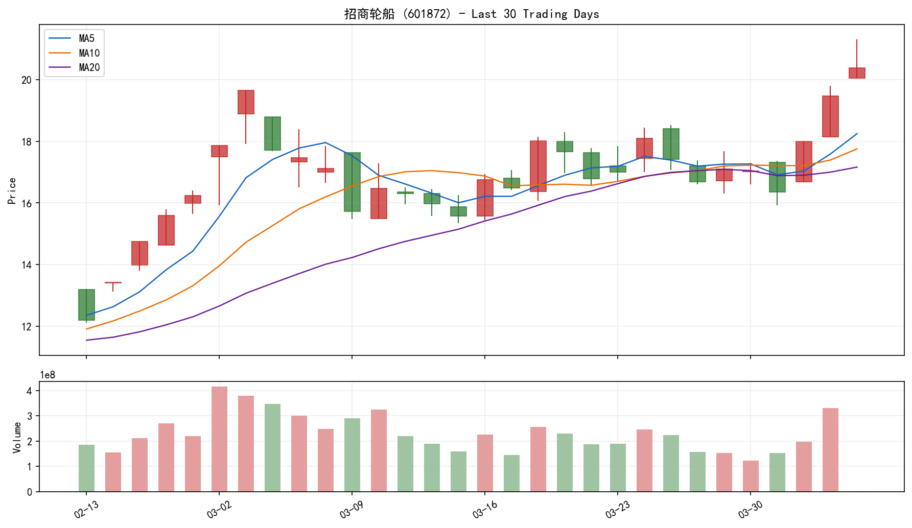
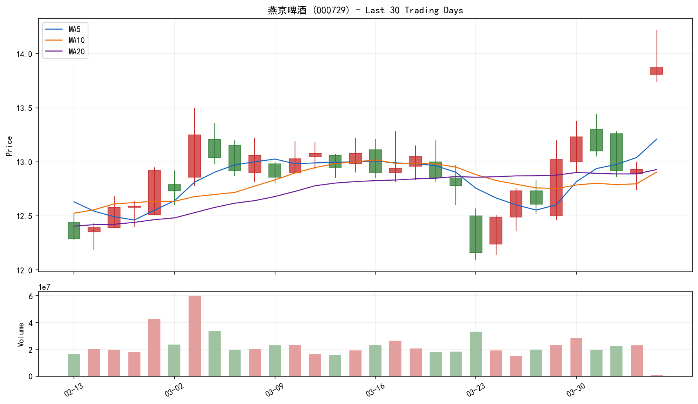
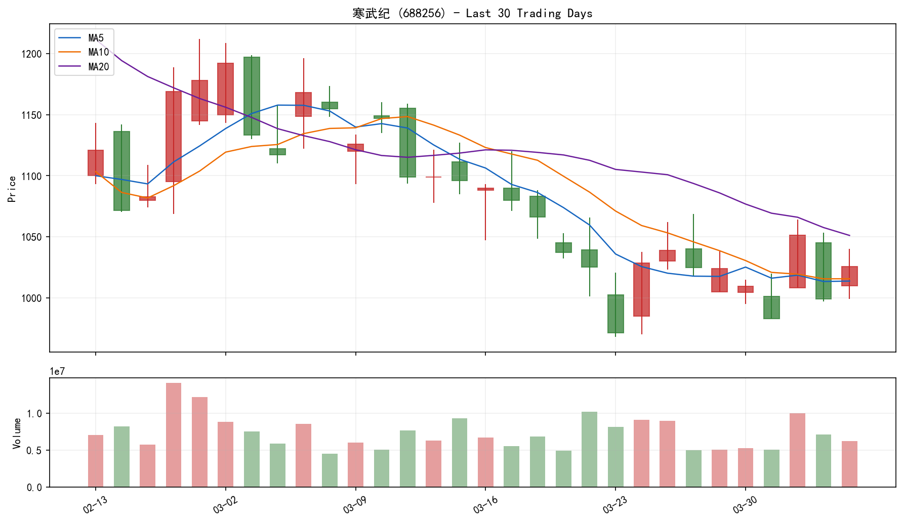

# A-share Stock Recommendation Report - 2026-04-06

## Summary
- Universe size: 305
- Successfully fetched: 303
- Qualified after filters: 303
- Filtered out by RSI > 80: 0
- Failed fetch or scoring: 2
- Source reachability: quote=up, kline=up

## Top 3

| Rank | Code | Name | Price | Change% | Cap | Tech | Fund | Sent | Total |
| --- | --- | --- | ---: | ---: | ---: | ---: | ---: | ---: | ---: |
| 1 | 601872 | 招商轮船 | 20.39 | +4.73% | 51.0 | 80.7 | 48.3 | 60.0 | 61.3 |
| 2 | 000729 | 燕京啤酒 | 13.87 | +7.27% | 54.0 | 68.9 | 55.0 | 63.3 | 59.7 |
| 3 | 688256 | 寒武纪 | 1025.70 | +2.67% | 68.6 | 52.1 | 38.3 | 70.0 | 59.6 |

## Top 3 Charts

### 1. 招商轮船 (601872)
- Sector: 基建交运 | RSI: 66.64 | MA20: 17.16 | Breakout Level: 19.80

### 2. 燕京啤酒 (000729)
- Sector: 白酒食品 | RSI: 63.43 | MA20: 12.93 | Breakout Level: 13.44

### 3. 寒武纪 (688256)
- Sector: 半导体电子 | RSI: 41.76 | MA20: 1051.07 | Breakout Level: 1173.34

